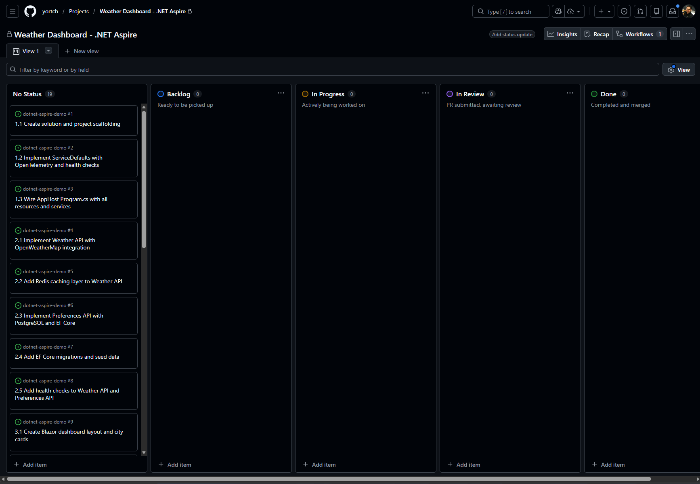
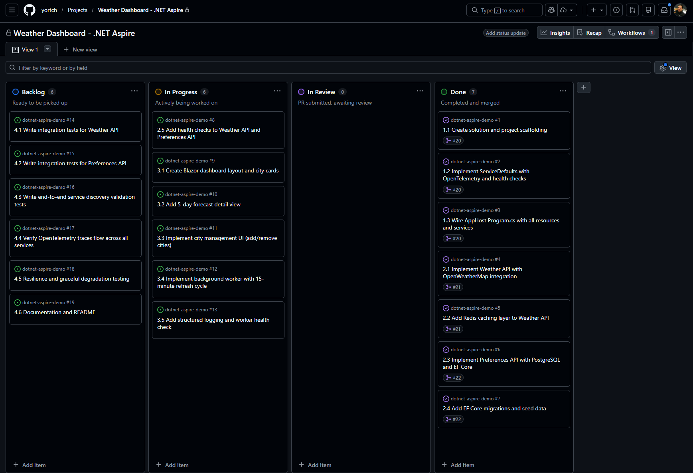
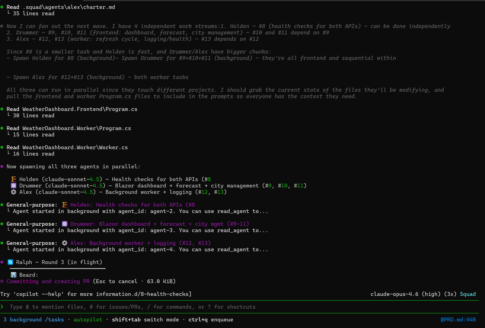
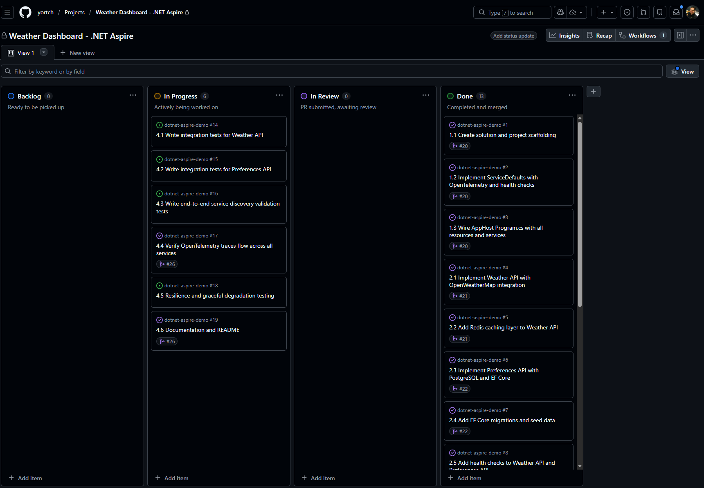
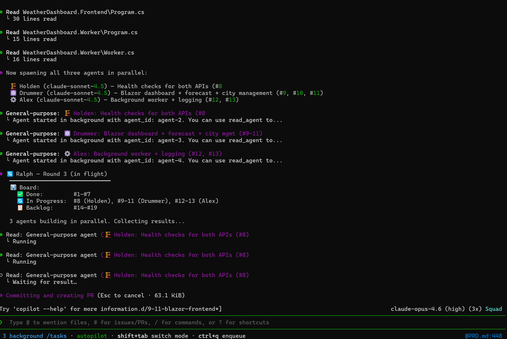
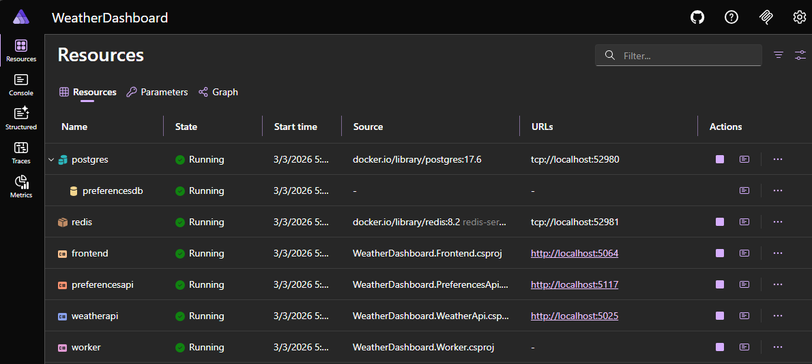
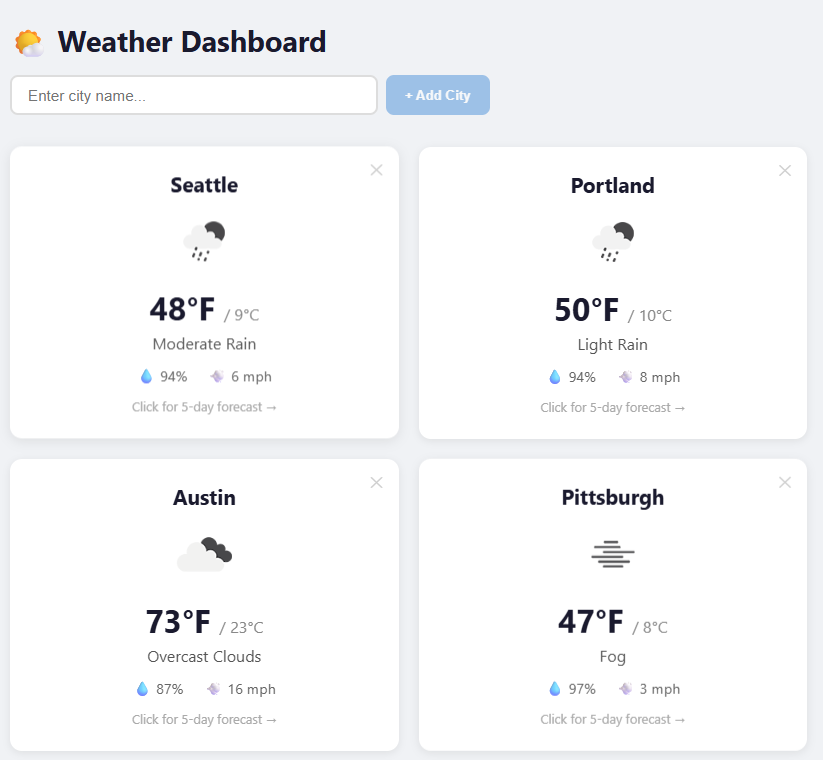

# Building a .NET Weather Dashboard with Copilot CLI and Squad
[](https://dotnet.microsoft.com/)
[](https://learn.microsoft.com/dotnet/aspire/)
[](LICENSE)

This repo demonstrates how to build a complete **.NET Aspire Weather Dashboard** from scratch using [**Squad**](https://github.com/bradygaster/squad), the [**GitHub Copilot CLI**](https://docs.github.com/en/copilot/how-tos/copilot-cli), and [**GitHub Project Boards**](https://docs.github.com/en/issues/planning-and-tracking-with-projects). A team of AI agents collaboratively scaffolded the entire solution — from service wiring to frontend UI — driven entirely through natural-language prompts and tracked via GitHub Issues.

## How this project was created

### Install Copilot CLI

Follow this [guide](https://docs.github.com/en/copilot/how-tos/copilot-cli/cli-getting-started) for more information on installing the GitHub Copilot CLI:

```
npm install -g @github/copilot
```

Launch the `copilot` CLI:

```
copilot
```

Use the `/login` command to login:

```
/login
```

### Initialize the project

Create the repo and bootstrap the Squad tooling:

```bash
mkdir dotnet-aspire-demo
cd dotnet-aspire-demo
git init
npx github:bradygaster/squad --auto-assign
```

### Initialize the Squad team

Launch the Copilot CLI and select the Squad agent. The prompt below is based on the [sample .NET Aspire prompt](https://bradygaster.github.io/squad/guide/sample-prompts.html) from the Squad docs.

```bash
copilot
```

Choose the Squad agent:

```
/agent Squad
```

Enter the following prompt to set up the team:

```text
Build a cloud-native application using .NET Aspire. Read https://learn.microsoft.com/en-us/dotnet/aspire/ for the Aspire programming model.

The app is a real-time weather dashboard:
- AppHost project orchestrating all services
- Frontend: Blazor Server dashboard showing current conditions and 5-day forecast for saved cities
- Weather API service: wraps OpenWeatherMap API with caching (Redis via Aspire integration)
- User Preferences service: stores saved cities per user (PostgreSQL via Aspire integration)
- Background Worker: refreshes cached weather data every 15 minutes for all saved cities (uses Aspire Worker template)
- Service-to-service communication via Aspire service discovery (no hardcoded URLs)
- Health checks and OpenTelemetry tracing via Aspire defaults

I want the team organized by Aspire integration:
- One agent owns the AppHost and service discovery wiring
- One agent owns the Redis caching integration
- One agent owns the PostgreSQL data layer
- One agent owns the Blazor frontend
- One agent owns the background worker
- The tester validates that services discover each other and data flows end-to-end

Set up the team. Each agent should understand their specific Aspire integration deeply.
```

Once the squad is assembled, you can ask copilot who is in your squad:

```
Who's in my squad?
```

Squad responds with your team — *Squad v0.5.4, cast from The Expanse universe* (7 active agents + Scribe + Ralph):

| Emoji | Name | Role |
|-------|------|------|
| 🏗️ | Holden | AppHost Lead — orchestration, service discovery, Aspire defaults |
| 🔴 | Naomi | Redis Dev — caching, IDistributedCache, weather cache layer |
| 🐘 | Amos | PostgreSQL Dev — EF Core, user preferences data model |
| ⚛️ | Drummer | Frontend Dev — Blazor Server dashboard, UI components |
| ⚙️ | Alex | Worker Dev — background refresh service |
| 🧪 | Bobbie | Tester — integration tests, service discovery validation |
| 🤖 | @copilot | Coding Agent — single-file tasks, bug fixes, docs |
| 📋 | Scribe | Session Logger |
| 🔄 | Ralph | Work Monitor |

### Push the Repo to GitHub

In a separate terminal, commit the generated Squad configuration and push:

```bash
git add .github/ .squad/ .squad-templates/ .gitattributes
git commit -m "feat: add copilot to squad"

git branch -M main
git remote add origin https://github.com/yortch/dotnet-aspire-demo.git
git push --set-upstream origin main
```

#### Optional: Add Copilot as a Squad Member

Create a new **classic** personal access token at <https://github.com/settings/tokens/new>, then grant project scope:

```bash
gh auth refresh -s project
```

Open the Copilot CLI and prompt:

```text
Add copilot to my squad
```

### Create the PRD and Project Board

Open the Copilot CLI and connect to the repo:

```text
connect to yortch/dotnet-aspire-demo
```

Then prompt it to generate the PRD and project board:

```text
Create a PRD for this project. Using the implementation plan, create a GitHub Project Board with columns for each workflow stage so that my squad can work using the Github board.
```

Once the PRD is created, you'll see a summary like this:

```
19 issues loaded across 4 phases — all starting in Backlog:

  - Phase 1 (#1-#3):   Foundation             — Holden
  - Phase 2 (#4-#8):   Core Services          — Naomi, Amos, Holden
  - Phase 3 (#9-#13):  Frontend & Worker      — Drummer, Alex
  - Phase 4 (#14-#19): Integration & Testing  — Bobbie, Holden

The squad is ready to build. You can kick things off with commands like
"Holden, start issue #1" or "Ralph, go" to run the pipeline.
```

### Prompt the Squad to start working

Prompt the CLI to kick off development and track progress on the board:

```text
start work, please ensure that progress on issues being worked on, is updated in the Project Board
```

The initial project board:



Progress tracked as the squad works through the issues:



Progress reported in the Copilot CLI:



The board as work nears completion:



And the squad reports completion in the CLI:



### End Result

All 4 phases (19 issues) were completed in **under 2 hours** using only **30 premium requests**:

```
● Total usage est:        30 Premium requests
  API time spent:         1h 16m 39s
  Total session time:     1h 55m 6s
  Total code changes:     +619 -3
  Breakdown by AI model:
    claude-opus-4.6       39.3m in, 229.4k out, 37.1m cached (Est. 30 Premium requests)
    claude-haiku-4.5      85.9k in, 1.9k out, 76.6k cached (Est. 0 Premium requests)
```

The .NET Aspire dashboard running:



The Weather app in action:



---

## About the Weather Dashboard

A real-time weather dashboard built with **.NET Aspire**, featuring a Blazor Server frontend, dual REST APIs backed by Redis and PostgreSQL, and a background worker for automatic data refresh — all wired together with Aspire's service discovery, health checks, and OpenTelemetry observability.

### Architecture Overview

The solution is composed of six projects orchestrated by .NET Aspire:

```
┌─────────────────────────────────────────────────────────────┐
│                     Aspire AppHost                          │
│              (Orchestration & Service Discovery)            │
├─────────────────────────────────────────────────────────────┤
│                                                             │
│  ┌───────────┐     ┌──────────────┐     ┌───────────────┐  │
│  │ Frontend   │────▶│ Weather API  │────▶│    Redis      │  │
│  │ (Blazor)   │     │ (ASP.NET)    │     │   (Cache)     │  │
│  │            │     └──────────────┘     └───────────────┘  │
│  │            │                                             │
│  │            │     ┌──────────────┐     ┌───────────────┐  │
│  │            │────▶│ Preferences  │────▶│ PostgreSQL    │  │
│  └───────────┘     │ API (ASP.NET)│     │   (Data)      │  │
│                     └──────────────┘     └───────────────┘  │
│  ┌───────────┐           ▲                                  │
│  │  Worker    │───────────┘                                 │
│  │ (Background│──────▶ Weather API                          │
│  │  Service)  │                                             │
│  └───────────┘                                              │
│                                                             │
│  ┌─────────────────────────────────────────────────────┐    │
│  │              ServiceDefaults                        │    │
│  │  (OpenTelemetry, Health Checks, Resilience)         │    │
│  └─────────────────────────────────────────────────────┘    │
└─────────────────────────────────────────────────────────────┘
```

| Project | Description |
|---------|-------------|
| **WeatherDashboard.AppHost** | .NET Aspire orchestrator — defines all services, containers, and their dependencies |
| **WeatherDashboard.Frontend** | Blazor Server UI for searching weather and managing city preferences |
| **WeatherDashboard.WeatherApi** | REST API that fetches weather data from OpenWeatherMap and caches results in Redis |
| **WeatherDashboard.PreferencesApi** | REST API for managing user city preferences, backed by PostgreSQL via EF Core |
| **WeatherDashboard.Worker** | Background service that periodically refreshes weather data for saved cities |
| **WeatherDashboard.ServiceDefaults** | Shared configuration for OpenTelemetry, health checks, resilience, and service discovery |

### Prerequisites

- [.NET 10 SDK](https://dotnet.microsoft.com/download/dotnet/10.0)
- [Docker Desktop](https://www.docker.com/products/docker-desktop/) (for Redis and PostgreSQL containers managed by Aspire)
- [OpenWeatherMap API key](https://openweathermap.org/api) (free tier is sufficient)

### Getting Started

1. **Clone the repository:**
   ```bash
   git clone https://github.com/yortch/dotnet-aspire-demo.git
   cd dotnet-aspire-demo
   ```

2. **Set your OpenWeatherMap API key:**

   Get a free API key by signing up at [openweathermap.org/api](https://openweathermap.org/api), then go to **My API Keys** to copy your key.

   ```bash
   dotnet user-secrets init --project WeatherDashboard.WeatherApi
   dotnet user-secrets set "OpenWeatherMap:ApiKey" "YOUR_KEY" --project WeatherDashboard.WeatherApi
   ```

3. **Run the application:**

   Make sure **Docker Desktop is running** before starting — Aspire uses it to spin up the Redis and PostgreSQL containers.

   ```bash
   dotnet run --project WeatherDashboard.AppHost
   ```

4. **Open the Aspire dashboard:**
   The terminal will display a dashboard URL (e.g., `https://localhost:17178`). Open it in your browser to see all services, traces, metrics, and logs.

5. **Use the app:**
   Click the Frontend URL shown in the Aspire dashboard to open the weather dashboard.

### Project Structure

```
dotnet-aspire-demo/
├── WeatherDashboard.AppHost/          # Aspire orchestrator
│   └── AppHost.cs                     # Service and container definitions
├── WeatherDashboard.Frontend/         # Blazor Server UI
│   ├── Components/                    # Razor components
│   └── Services/                      # API client services
├── WeatherDashboard.WeatherApi/       # Weather REST API
│   ├── Endpoints/                     # Minimal API endpoints
│   ├── Services/                      # OpenWeatherMap + cache services
│   └── HealthChecks/                  # Custom health checks
├── WeatherDashboard.PreferencesApi/   # Preferences REST API
│   ├── Endpoints/                     # Minimal API endpoints
│   ├── Data/                          # EF Core DbContext and migrations
│   └── Models/                        # Data models
├── WeatherDashboard.Worker/           # Background refresh service
│   └── Services/                      # Worker and health check services
├── WeatherDashboard.ServiceDefaults/  # Shared Aspire defaults
│   └── Extensions.cs                  # OpenTelemetry, health checks, resilience
└── docs/                              # Documentation
```

### API Endpoints

#### Weather API

| Method | Endpoint | Description |
|--------|----------|-------------|
| `GET` | `/api/weather/{city}` | Get current weather for a city (cached in Redis) |
| `GET` | `/api/weather/{city}/forecast` | Get weather forecast for a city (cached in Redis) |

#### Preferences API

| Method | Endpoint | Description |
|--------|----------|-------------|
| `GET` | `/api/preferences/cities` | Get all distinct saved cities |
| `GET` | `/api/preferences/{userId}` | Get preferences for a specific user |
| `POST` | `/api/preferences/{userId}` | Add a city to a user's preferences (body: `{ "city": "Seattle" }`) |
| `DELETE` | `/api/preferences/{userId}/{city}` | Remove a city from a user's preferences |

#### Health Endpoints (all services)

| Endpoint | Description |
|----------|-------------|
| `/health` | Full readiness check |
| `/alive` | Liveness check |

### Configuration

#### User Secrets

| Key | Project | Description |
|-----|---------|-------------|
| `OpenWeatherMap:ApiKey` | WeatherApi | API key for OpenWeatherMap (required) |

#### Environment Variables (set automatically by Aspire)

| Variable | Description |
|----------|-------------|
| `OTEL_EXPORTER_OTLP_ENDPOINT` | OpenTelemetry collector endpoint |
| `ConnectionStrings__redis` | Redis connection string |
| `ConnectionStrings__preferencesdb` | PostgreSQL connection string |

### Testing

Run integration tests (if available) with:

```bash
dotnet test
```

For manual verification of the full system:

1. Start the AppHost (`dotnet run --project WeatherDashboard.AppHost`).
2. Use the Aspire dashboard to verify all services are healthy.
3. Exercise the Frontend UI and check traces in the dashboard.

See [docs/telemetry-verification.md](docs/telemetry-verification.md) for detailed OpenTelemetry trace verification steps.

### Architecture Decisions

Design decisions and the product requirements document are maintained in:

- [docs/PRD.md](docs/PRD.md) — Product Requirements Document

### Built With

- [Squad](https://github.com/bradygaster/squad) - Squad gives you an AI development team through GitHub Copilot
- [GitHub Copilot CLI](https://docs.github.com/en/copilot/how-tos/copilot-cli) - Use GitHub Copilot directly from you terminal
- [.NET Aspire](https://learn.microsoft.com/dotnet/aspire/) — Cloud-native orchestration and service defaults
- [Blazor Server](https://learn.microsoft.com/aspnet/core/blazor/) — Interactive server-side UI
- [ASP.NET Core Minimal APIs](https://learn.microsoft.com/aspnet/core/fundamentals/minimal-apis) — Lightweight REST endpoints
- [Redis](https://redis.io/) — Distributed caching for weather data
- [PostgreSQL](https://www.postgresql.org/) — Persistent storage for user preferences
- [Entity Framework Core](https://learn.microsoft.com/ef/core/) — ORM for PostgreSQL
- [OpenTelemetry](https://opentelemetry.io/) — Distributed tracing, metrics, and logging
- [OpenWeatherMap API](https://openweathermap.org/api) — Weather data provider
